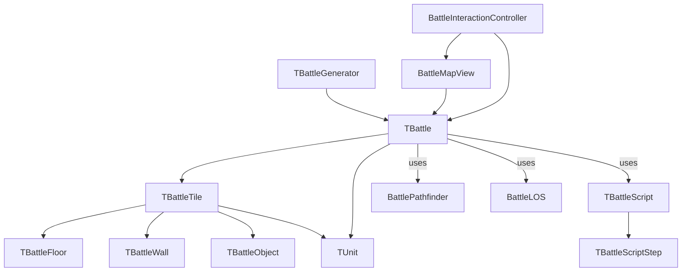

# Battlescape Engine Documentation

## Battlescape Engine Class Interconnection Diagram



---

## Overview

The battlescape engine is responsible for generating, managing, and simulating tactical battles in the game. It handles map generation, tile logic, units, AI, pathfinding, line of sight, fog of war, and user interaction.

---

## Main Architecture Diagram


---

## Class Responsibilities

### TBattle
- **Purpose:** Central class for a battle instance. Holds the 2D grid of tiles, manages units, sides, fog of war, lighting, and turn logic.
- **Key Methods:**  
  - `add_unit(unit, side, x, y)`
  - `process_turn()`
  - `process_side(side)`
  - `update_fog_of_war()`
  - `update_lighting()`
  - `get_diplomacy_action(attacker_side, target_side)`

---

### TBattleGenerator
- **Purpose:** Generates the battle map using terrain, map blocks, and a battle script.
- **Key Methods:**  
  - `generate()`
  - `_add_line_blocks()`, `_add_random_block()`, `_add_special_block()`, `_fill_remaining_blocks()`

---

### TBattleScript & TBattleScriptStep
- **Purpose:** Script-driven map generation. Each step defines how to place map blocks (lines, random, special, fill).
- **Key Methods:**  
  - `apply_to(generator)`

---

### TBattleTile
- **Purpose:** Represents a single tile on the map. Contains references to floor, wall, objects, and a unit. Handles environmental effects (fire, smoke, gas), light, and fog of war.
- **Key Methods:**  
  - `is_walkable()`
  - `get_move_cost()`
  - `get_sight_cost()`
  - `apply_damage()`
  - `apply_point_damage()`
  - `apply_area_damage()`
  - `destroy_floor()`, `destroy_wall()`, `destroy_object(obj)`

---

### TBattleFloor, TBattleWall, TBattleObject
- **Purpose:** Represent the physical components of a tile.
  - **TBattleFloor:** Move cost, sight/accuracy modifiers, armor, sound, light, destruction logic.
  - **TBattleWall:** Blocks movement, sight/fire modifiers, armor, material, destruction, explosion, light.
  - **TBattleObject:** Non-blocking, can be destroyed, may emit light.

---

### TUnit
- **Purpose:** Represents a unit (soldier, alien, etc.) on the map. Handles movement, actions, and state.

---

### Pathfinding & LOS

#### BattlePathfinder
- **Purpose:** Static class for A* pathfinding using tile move cost and walkability.
- **Key Method:**  
  - `find_path(battle, start, end, unit_size=1)`

#### BattleLOS
- **Purpose:** Static class for line-of-sight calculation using tile properties (floor, wall, smoke, fire).
- **Key Method:**  
  - `has_los(battle, start, end, max_range=22)`

---

### Map Generation

#### TTerrain
- **Purpose:** Defines terrain type, holds map blocks and script for map generation.

#### TMapBlock, TMapBlockEntry
- **Purpose:** Represent map blocks (chunks of tiles) and their metadata for map generation.

---

### Visualization & Interaction (engine/gui/)

#### BattleMapView
- **Purpose:** Visualizes the battle map and units using QGraphicsView/QGraphicsScene. Handles efficient drawing and updating.

#### UnitGraphicsItem
- **Purpose:** Visual representation of a unit.

#### BattleInteractionController
- **Purpose:** Handles user input (mouse, wheel, selection, path planning) and delegates to map view and battle logic.

---

## Example Flow

1. **Map Generation:**  
   - `TBattleGenerator` uses `TTerrain`, `TMapBlockEntry`, and `TBattleScript` to generate a 2D grid of `TBattleTile`.
2. **Battle Setup:**  
   - `TBattle` is created with the generated map, units are added to sides.
3. **Visualization:**  
   - `BattleMapView` draws the map and units.
4. **User Interaction:**  
   - `BattleInteractionController` handles input, selection, and commands.
5. **Gameplay Loop:**  
   - `TBattle` processes turns, updates fog of war and lighting.
   - Pathfinding and LOS are handled by `BattlePathfinder` and `BattleLOS`.
   - Damage, environmental effects, and diplomacy are managed at the tile and battle level.

---

## Example: Pathfinding and LOS

```python
from engine.battle.support.battle_pathfinder import BattlePathfinder
from engine.battle.support.battle_los import BattleLOS

# Find a path for a unit
path = BattlePathfinder.find_path(battle, (unit.x, unit.y), (target_x, target_y))

# Check line of sight
if BattleLOS.has_los(battle, (unit.x, unit.y), (enemy.x, enemy.y)):
    # Can see the enemy
    pass
```

---

## Example: Damage Application

```python
tile = battle.tiles[y][x]
tile.apply_damage(
    damage=50,
    method='AREA',
    damage_type='explosive',
    damage_model={'hurt': 0.8, 'stun': 0.2},
    source=unit,
    area_params={'radius': 2, 'dropoff': 10},
    battle=battle,
    x=x,
    y=y
)
```

---

## Diplomacy Table

|        | 0 (Player) | 1 (Enemy) | 2 (Ally) | 3 (Neutral) |
|--------|------------|-----------|----------|-------------|
| **0**  |    0       |     1     |    0     |     0       |
| **1**  |    1       |     0     |    1     |     2       |
| **2**  |    0       |     1     |    0     |    -1       |
| **3**  |    0       |     2     |   -1     |     0       |

- 0 = ignore, 1 = hostile, 2 = opportunistic, -1 = protect

---

## Extending the Engine

- Add new tile types, objects, or environmental effects by extending `TBattleTile` and its components.
- Add new AI logic or user interaction by extending `BattleInteractionController` and `TBattle`.
- Add new map generation logic by extending `TBattleScript` and `TBattleGenerator`.

---

## Summary

The battlescape engine is modular, extensible, and optimized for both logic and visualization. Each class has a clear responsibility, and the architecture supports advanced features like fog of war, lighting, diplomacy, and environmental effects.

---

**For more details, see the code in `engine/battle/` and `engine/gui/`.**

