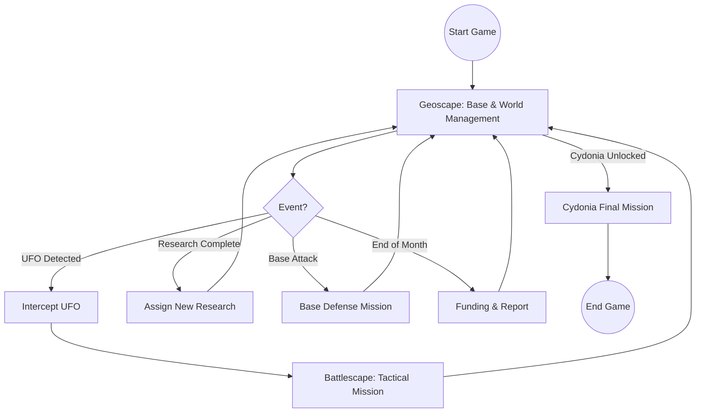

# UFO: Enemy Unknown (X-COM: UFO Defense) — Comprehensive System & Feature Reference

This document merges and expands upon all major and minor systems, mechanics, and content in the original UFO: Enemy Unknown (X-COM: UFO Defense), combining both the detailed feature reference and the high-level game design document (GDD) for maximum clarity and completeness.

---

## Lore & Story Overview
The year is 1999. Humanity faces a terrifying new threat: mysterious UFOs appear in the skies, abducting civilians and attacking cities. Governments are powerless to stop the alien menace, so they secretly fund the creation of X-COM (Extraterrestrial Combat Unit), an elite, international organization tasked with defending Earth. As X-COM’s commander, you must manage resources, research alien technology, and lead squads in desperate tactical battles. The aliens’ true motives are gradually revealed through research and interrogation: they seek to conquer Earth, harvest its resources, and ultimately enslave humanity. The campaign culminates in a final assault on the alien base on Mars—Cydonia—where the fate of the planet is decided.

---

## Table of Contents
1. Game Structure & Flow
2. Geoscape (Strategic Layer)
3. Base Management
4. Facilities (Base Modules)
5. Personnel Management
6. Research & Technology Tree
7. Manufacturing (Engineering)
8. Interception & Air Combat
9. Battlescape (Tactical Combat)
10. Soldiers: Stats, Progression, and Morale
11. Aliens: Races, Behavior, and Missions
12. UFOs: Types, Layouts, and Missions
13. Equipment, Weapons, and Inventory
14. Economy, Funding, and World Relations
15. Victory, Defeat, and Endgame
16. User Interface & Quality of Life
17. Miscellaneous Features
18. References

---

## 1. Game Structure & Flow
### Dual-Layer Gameplay
- **Geoscape:**
  - Real-time global strategy, base/resource management, event response.
  - Time management, detection, interception, and resource allocation.
- **Battlescape:**
  - Turn-based tactical combat, squad-level control, destructible environments.
  - Mission objectives: eliminate/capture aliens, rescue civilians, recover artifacts.

### Progression
- **Research-driven:** Unlock new tech, crafts, and story progression via research.
- **Base Expansion:** Build new bases for coverage, redundancy, and specialization.
- **Alien Escalation:** Aliens increase mission frequency, tech, and aggression over time.

### Permadeath & Persistence
- **Permanent Loss:** Soldiers, equipment, and resources lost in combat are gone forever.
- **Veteran Value:** Surviving soldiers gain experience and become valuable assets.

### Difficulty Levels
- **Beginner, Experienced, Veteran, Genius, Superhuman:**
  - Affect alien stats, mission frequency, aggression, and funding.
  - Higher levels: more aliens, tougher AI, less forgiving economy.

### Save/Load System
- **Manual & Auto-Save:**
  - Save at any time in Geoscape or Battlescape.
  - Multiple slots for experimentation and recovery.

### Game Loop Flowchart

---

## 2. Geoscape (Strategic Layer)
### World Map & Time
- **3D Globe:**
  - Shows bases, aircraft, UFOs, alien bases, mission sites, and funding regions.
  - Day/night cycle affects detection and tactical missions (night missions are harder).
- **Time Controls:**
  - 5s, 1min, 5min, 30min, 1hr, 1day increments; pause/resume.
  - Time advances only in Geoscape, not during tactical missions.

### Event System
- **Random & Scripted Events:**
  - UFO sightings, terror attacks, alien bases, funding changes, research/manufacturing completion, personnel arrivals, base construction.
  - Events can overlap, requiring prioritization.

### Base Placement & Coverage
- **Initial Base:**
  - Player chooses location; affects radar coverage and response times.
- **Additional Bases:**
  - Up to 8 bases; can specialize (e.g., research, manufacturing, interception).
  - Strategic placement covers more of the globe, reducing UFO escape.

### Mission Generation
- **UFO Missions:**
  - Abduction, Harvest, Research, Terror, Infiltration, Base Construction, Retaliation, Supply.
  - Each mission type has unique UFO behavior and consequences.
- **Terror Sites:**
  - Appear in cities; must be responded to quickly or funding nations panic.
- **Alien Bases:**
  - Hidden until detected; generate UFO traffic and increase alien influence.

### Funding Nations & Relations
- **16 Nations:**
  - Each with a region; funding is based on X-COM performance in their area.
- **Panic & Pacts:**
  - Poor performance leads to panic or nations signing pacts with aliens (loss of funding).

---

## 3. Base Management
### Construction & Layout
- **Facility Grid:**
  - Bases are built on a grid; all facilities must connect to the access lift.
  - Construction time and cost vary by facility.
- **Strategic Layout:**
  - Placement affects base defense (entry points, choke points, defense coverage).
- **Multiple Bases:**
  - Each base is managed independently (personnel, craft, resources, research, manufacturing).

### Resource Storage & Logistics
- **General Stores:**
  - Store all equipment, alien artifacts, Elerium-115, and corpses.
- **Transfers:**
  - Move personnel, equipment, and crafts between bases (with transfer time).
- **Arrival Delays:**
  - New hires and transfers take time to arrive at their destination.

### Base Defense
- **Alien Attacks:**
  - Bases can be attacked, triggering defense missions using the base layout as the tactical map.
- **Automated Defenses:**
  - Missile, laser, plasma, and grav shield modules can damage or repel attacking UFOs before ground combat.
- **Base Defense Mission:**
  - If defenses fail, a tactical battle occurs; loss means destruction of the base.

---

## 4. Facilities (Base Modules)
| Facility           | Function                                      | Capacity/Effect                | Build Time | Cost     |
|--------------------|-----------------------------------------------|-------------------------------|------------|----------|
| Access Lift        | Entry/exit for personnel/aliens               | 1 per base                    | 6 days     | $300,000 |
| Living Quarters    | Houses personnel                              | 50 per module                 | 16 days    | $400,000 |
| Laboratory         | Research projects                             | 50 scientists per lab         | 26 days    | $750,000 |
| Workshop           | Manufacturing projects                        | 50 engineers per workshop     | 32 days    | $800,000 |
| General Stores     | Stores all items and artifacts                | 50 units per module           | 10 days    | $150,000 |
| Hangar             | Houses one craft                              | 1 craft per hangar            | 25 days    | $200,000 |
| Small Radar        | Detects UFOs (short range)                    | 10%/30min, 3000nm             | 12 days    | $500,000 |
| Large Radar        | Detects UFOs (long range)                     | 20%/30min, 4500nm             | 25 days    | $1,000,000 |
| Missile Defenses   | Automated base defense                        | 20 damage per module          | 12 days    | $200,000 |
| Laser Defenses     | Improved base defense                         | 70 damage per module          | 18 days    | $800,000 |
| Plasma Defenses    | Advanced base defense                         | 140 damage per module         | 22 days    | $1,200,000 |
| Grav Shield        | Repels attacking UFOs, increases defense      | +50% defense, delays entry    | 25 days    | $800,000 |
| Alien Containment  | Holds live aliens for research                | 10 aliens per module          | 18 days    | $400,000 |
| Psi Lab            | Trains soldiers in psionics                   | 10 soldiers per lab/month     | 30 days    | $750,000 |
| Hyperwave Decoder  | Perfect UFO detection, mission/race info      | 100% detection, all info      | 30 days    | $1,200,000 |
| Mind Shield        | Reduces chance of base detection by aliens    | -50% detection chance         | 30 days    | $2,000,000 |

- **Facility Upkeep:** Each facility has a monthly maintenance cost.
- **Destruction:** Destroyed facilities (in base defense) are lost and must be rebuilt.

---

## 5. Personnel Management
- **Soldiers:**
  - Recruit, assign to squads, equip, and transfer. Each has unique stats and names.
  - Can be assigned to crafts for missions.
- **Scientists:**
  - Hire and assign to research projects; more scientists = faster research.
- **Engineers:**
  - Hire and assign to manufacturing projects; more engineers = faster production.
- **Hiring/Firing:**
  - Hire or sack staff; costs money and time.
- **Transfers:**
  - Move personnel, equipment, and crafts between bases (with transfer time).
- **Arrival Delays:**
  - New hires and transfers take time to arrive at their destination.

---

## 6. Research & Technology Tree
- **Research Topics:**
  - Alien corpses, live aliens, UFO components, alien weapons, armor, crafts, psionics, and story-critical tech.
- **Dependencies:**
  - Some topics require prior research or captured aliens.
- **Alien Interrogation:**
  - Captured aliens unlock unique research (e.g., alien missions, psionics, Cydonia location).
- **Research Output:**
  - Unlocks new equipment, crafts, facilities, and the final mission.
- **Research Management:**
  - Assign scientists, manage priorities, and monitor progress.
- **Research Speed:**
  - Determined by number of scientists and project complexity.
- **UFOpaedia:**
  - In-game encyclopedia updated with each completed research topic.

---

## 7. Manufacturing (Engineering)
- **Production Queue:**
  - Select items to manufacture; assign engineers and allocate resources.
- **Resource Requirements:**
  - Some items require alien alloys, Elerium-115, or other recovered materials.
- **Production Time & Cost:**
  - Each item has a build time and cost per unit.
- **Selling:**
  - Manufactured and recovered items can be sold for profit (except Elerium-115 and alien corpses).
- **Manufacturing Management:**
  - Assign engineers, manage priorities, and monitor progress.

---

## 8. Interception & Air Combat
- **Craft Types:**
  - Interceptors (Fighter), Skyranger (Transport), Firestorm, Lightning, Avenger (advanced alien-tech crafts).
- **Loadout:**
  - Equip crafts with weapons (cannons, missiles, plasma beams, fusion ball launchers).
- **Detection:**
  - Radar range and detection chance; Hyperwave Decoder for perfect detection.
- **Air Combat UI:**
  - Real-time minigame: approach, engage, disengage, use weapons, or retreat.
- **UFO Crash/Landing:**
  - Downed or landed UFOs generate ground missions.
- **Craft Damage & Repair:**
  - Damaged crafts require time to repair in hangars.
- **Fuel & Ammo:**
  - Crafts consume fuel and ammunition; must return to base to refuel/rearm.

---

## 9. Battlescape (Tactical Combat)
- **Mission Types:**
  - UFO Crash Recovery, UFO Landing, Terror Site, Base Defense, Alien Base Assault, Cydonia Final Mission.
- **Turn-Based System:**
  - Each side takes turns; soldiers have Time Units (TUs) for actions.
- **Actions:**
  - Move, kneel, fire (snap, aimed, auto), throw, reload, use items, open doors, pick up/drop items.
- **Fog of War:**
  - Limited vision; line-of-sight and night missions (use flares).
- **Destructible Environment:**
  - Buildings, terrain, and UFOs can be destroyed.
- **Morale & Panic:**
  - Low morale can cause panic or berserk behavior.
- **Civilians:**
  - Present in terror missions; can be killed or saved.
- **Victory/Defeat:**
  - Win by eliminating/capturing all aliens; lose if all soldiers are killed or withdraw.
- **Loot & Recovery:**
  - Surviving soldiers and recovered items return to base.
- **Environmental Hazards:**
  - Fire, smoke, explosions, and terrain hazards affect combat.
- **AI Behavior:**
  - Aliens use cover, patrol, ambush, and use psionics.
- **Opportunity Fire (Reaction Shots):**
  - Units with unspent TUs may fire during the enemy turn if a hostile is spotted.
- **Wounds & Bleeding:**
  - Soldiers can suffer wounds that cause bleeding each turn; medikits can stop bleeding.
- **Unconsciousness:**
  - Soldiers and aliens can be knocked unconscious (stun damage); may recover during mission.

---

## 10. Soldiers: Stats, Progression, and Morale
- **Attributes:**
  - Time Units, Stamina, Health, Strength, Firing Accuracy, Throwing Accuracy, Bravery, Reactions, Psi Strength, Psi Skill, Rank.
- **Experience:**
  - Stats improve with use (e.g., firing increases accuracy, psi use increases psi skill).
- **Ranks:**
  - Rookie, Squaddie, Sergeant, Captain, Colonel, Commander; higher ranks boost squad morale.
- **Wounds & Death:**
  - Wounded soldiers require recovery time; dead soldiers are lost permanently.
- **Morale System:**
  - Affected by casualties, alien attacks, and mission events.
- **Psionics:**
  - Psi Lab training unlocks psi attacks (panic, mind control) for soldiers with sufficient psi strength.
- **Medals & Promotions:**
  - Soldiers are promoted based on performance and squad composition.
- **Fatigue:**
  - Stamina is consumed by movement and actions; low stamina reduces TUs.

---

## 11. Aliens: Races, Behavior, and Missions
- **Alien Races:**
  - Sectoid, Floater, Snakeman, Muton, Ethereal, Celatid, Silacoid, Chryssalid, Reaper, Sectopod, Cyberdisc.
- **Unique Abilities:**
  - Mind control (Ethereal, Sectoid), zombification (Chryssalid), flying (Floater, Cyberdisc), heavy armor (Sectopod).
- **Alien Missions:**
  - Abduction, Harvest, Research, Terror, Infiltration, Base Construction, Retaliation, Supply.
- **AI Behavior:**
  - Patrol, ambush, seek and destroy, defend UFO/base, use of psionics.
- **Alien Bases:**
  - Aliens build hidden bases; can be discovered and assaulted.
- **Alien Equipment:**
  - Aliens use plasma weapons, grenades, and special items (mind probe, blaster launcher).
- **Psionics:**
  - Some aliens can panic or mind control soldiers; resistance depends on soldier psi strength.

---

## 12. UFOs: Types, Layouts, and Missions
- **UFO Types:**
  - Small Scout, Medium Scout, Large Scout, Harvester, Abductor, Supply Ship, Terror Ship, Battleship.
- **Roles:**
  - Each UFO type is used for specific alien missions and has unique interior layouts.
- **UFO Components:**
  - Power Source, Navigation, Alien Alloys, Elerium-115, UFO Construction, etc.
- **Mission Progression:**
  - UFOs perform missions on the Geoscape, triggering events and missions.
- **UFO Recovery:**
  - Recovered UFOs provide research materials and loot.
- **UFOpaedia Entries:**
  - Each UFO type and component has a detailed in-game encyclopedia entry.

---

## 13. Equipment, Weapons, and Inventory
- **Weapon Types:**
  - Ballistic (rifle, pistol, heavy cannon), Laser, Plasma, Blaster Launcher, Rocket Launcher, Stun Rod, Small Launcher.
- **Ammunition:**
  - Standard, incendiary, high-explosive, stun bombs, Elerium-based.
- **Armor:**
  - Personal Armor, Power Suit, Flying Suit.
- **Special Equipment:**
  - Medikit, Motion Scanner, Mind Probe, Electro-flare, Psi-Amp.
- **Inventory System:**
  - Soldiers have hand, belt, backpack, shoulder, and ground slots; weight affects TUs and stamina.
- **Item Recovery:**
  - Only items carried or in the transport at mission end are recovered.
- **Encumbrance:**
  - Carrying too much weight reduces TUs and stamina.
- **Explosives:**
  - Grenades, high-explosive packs, proximity grenades, and rockets.
- **Weapon Modes:**
  - Snap shot, aimed shot, auto shot (where available); each with different TU costs and accuracy.
- **Stun & Capture:**
  - Stun rods and small launchers can incapacitate aliens for capture and research.

---

## 14. Economy, Funding, and World Relations
- **Funding Nations:**
  - 16 nations provide monthly funding; can increase, decrease, or withdraw support.
- **Monthly Reports:**
  - Performance-based funding adjustments; nations may sign pacts with aliens.
- **Income & Expenses:**
  - Funding, sales, and manufacturing vs. salaries, maintenance, construction, and purchases.
- **Black Market:**
  - Sell recovered alien artifacts and manufactured goods for profit.
- **Game Over:**
  - Two consecutive months of negative balance or all nations withdrawing ends the game.
- **Panic & Infiltration:**
  - Nations may panic or sign pacts with aliens if not protected; affects funding and game outcome.

---

## 15. Victory, Defeat, and Endgame
- **Victory:**
  - Research and unlock the Cydonia or Bust mission; send a squad to Mars and defeat the Alien Brain.
- **Defeat:**
  - X-COM is disbanded if funding is lost, all bases are destroyed, or the Cydonia mission fails.
- **Multiple Endings:**
  - Victory (Earth saved) or defeat (Earth conquered/terraforming begins).
- **Endgame Sequence:**
  - Final mission at Cydonia is a two-stage tactical battle.

---

## 16. User Interface & Quality of Life
- **UFOpaedia:**
  - In-game encyclopedia with detailed info on all researched items, aliens, and equipment.
- **Save/Load:**
  - Multiple save slots; manual and auto-save.
- **Options:**
  - Difficulty levels, sound/music, controls.
- **Notifications:**
  - Pop-ups for research, manufacturing, UFO detection, funding changes, and mission events.
- **Graphical UI:**
  - Icon-based, mouse-driven interface; isometric tactical view.
- **Hotkeys:**
  - Keyboard shortcuts for common actions in both Geoscape and Battlescape.
- **Tooltips:**
  - Mouse-over tooltips for UI elements and equipment.

---

## 17. Miscellaneous Features
- **Sound & Music:**
  - Dynamic soundtrack and sound effects for Geoscape, Battlescape, and events.
- **Randomization:**
  - Procedural map generation for tactical missions; random soldier stats and names.
- **Localization:**
  - Multiple language support in some versions.
- **Modding & Community:**
  - OpenXcom and other projects have extended/modded the original game.

---

## 18. References
- [Wikipedia: UFO: Enemy Unknown](https://en.wikipedia.org/wiki/UFO:_Enemy_Unknown)
- [UFOPaedia.org](https://www.ufopaedia.org/index.php/UFO:_Enemy_Unknown)
- [StrategyWiki: X-COM: UFO Defense](https://strategywiki.org/wiki/X-COM:_UFO_Defense)

---

# Appendix: High-Level Game Design Overview (GDD)

This appendix provides a concise, high-level summary of the core gameplay loop and major systems, as originally structured in the GDD:

## Game Structure & Flow
- Dual-layer gameplay: Geoscape (global strategy) and Battlescape (tactical combat).
- Real-time Geoscape with time controls; turn-based tactical missions.
- Progression via research, base expansion, and defeating alien threats.
- Permadeath and persistent resources.

## Geoscape (Strategic Layer)
- 3D globe with day/night, bases, aircraft, UFOs, alien bases, and mission sites.
- Time controls and event system (UFOs, terror, research, funding, etc.).
- Up to 8 bases; strategic placement and coverage.

## Base Management
- Facilities: Living Quarters, Labs, Workshops, Stores, Hangars, Radar, Defenses, Alien Containment, Psi Lab, Hyperwave Decoder, Mind Shield.
- Construction grid, resource storage, base defense, personnel/craft management, transfers.

## Personnel Management
- Soldiers: recruit, assign, equip, transfer; unique stats and names.
- Scientists: assign to research; more = faster.
- Engineers: assign to manufacturing; more = faster.
- Hiring/firing costs and delays.

## Research & Technology Tree
- Topics: corpses, live aliens, UFO parts, weapons, armor, crafts, psionics, story tech.
- Dependencies, interrogation, research output, management.

## Manufacturing (Engineering)
- Production queue, resource requirements, time/cost, selling.

## Interception & Air Combat
- Craft types, loadout, detection, air combat UI, crash/landing missions.

## Battlescape (Tactical Combat)
- Mission types, turn-based system, actions, fog of war, destructible environment, morale, civilians, victory/defeat, loot.

## Soldiers: Stats, Progression, and Morale
- Attributes, experience, ranks, wounds/death, morale, psionics.

## Aliens: Races, Behavior, and Missions
- Races, unique abilities, missions, AI, bases.

## UFOs: Types and Missions
- Types, roles, components, mission progression.

## Equipment, Weapons, and Inventory
- Weapon types, ammo, armor, special equipment, inventory system, item recovery.

## Economy, Funding, and World Relations
- Funding nations, monthly reports, income/expenses, black market, game over.

## Victory, Defeat, and Endgame
- Victory (Cydonia), defeat, multiple endings.

## User Interface & Quality of Life
- UFOpaedia, save/load, options, notifications, graphical UI.

## References
- Wikipedia, UFOPaedia, StrategyWiki.

---

*This merged document is a comprehensive, feature-level and high-level summary for design, analysis, and comparison. For in-depth mechanics, see the referenced wikis and original game manuals.*
