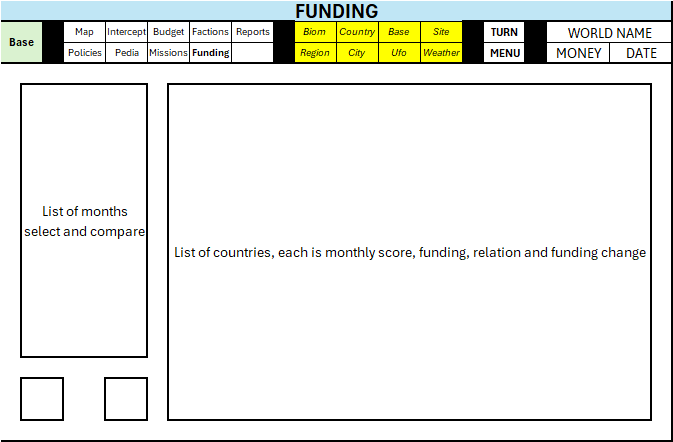

# Game GUI

- game has 4 main screens:
  - battlescape, 
  - basescape 
  - geoscape
  - main menu
- each screen has a section on top to switch to sub screen

## Battlescape

## Basescape

#### Units

#### Crafts
 

#### Prison (all captured units)

#### Training & Education

#### Hospital & Recovery

#### Units archive

#### Research

#### Manufacturing

#### Market (purchase & sale)

#### Facilities

#### Storage

#### Transfers

#### Base info

## Geoscape

#### World map

#### Intercept

#### Budget 

#### Diplomacy

#### Reports

#### Policies

#### Pedia 

#### Missions

#### Funding

#### Menu 

