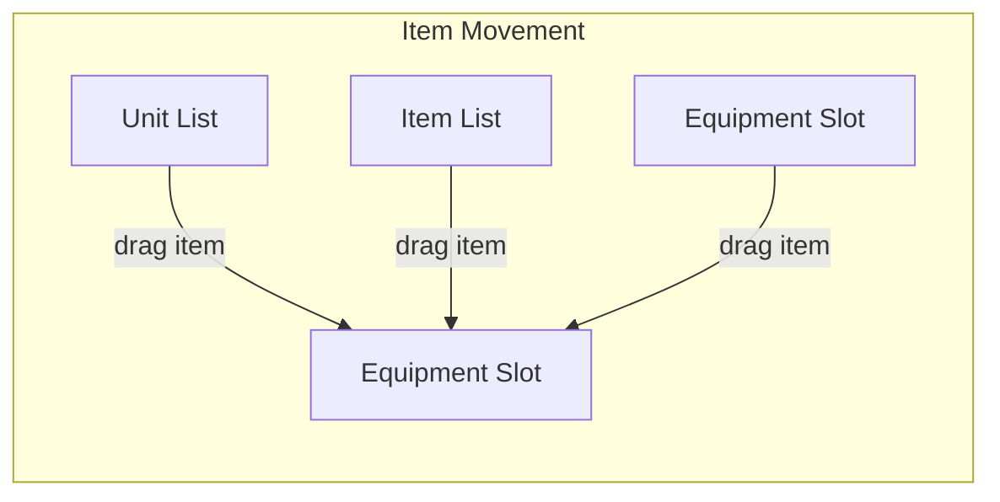

# XCOM UI Theme Demo - Detailed Functional Documentation

## Purpose
- Demonstrates a scalable, grid-based, XCOM-inspired UI using PySide6 (Qt for Python).
- Provides a themed interface with custom styling, drag-and-drop equipment slots, and list widgets for units and items.

## Main Functional Areas

### 1. Theme and Style System
- **XcomTheme class**: Centralizes all color, font, and dimension constants for the UI.
- **XcomStyle class**: Provides static methods to generate Qt stylesheets for various widgets (buttons, groupboxes, comboboxes, list widgets, labels).
- **px(x) helper**: Scales UI elements according to a global scale factor.

---

### 2. Top Panel UI (created by `create_top_panel()`)
- **Navigation Buttons** (`QPushButton`):
  - Labels: GEO, BUILD, BARRACKS, HANGAR, STORAGE, TRANSFER, PRISON, ACADEMY, WORKSHOP, LAB, MARKET, ARCHIVE, INFO.
  - Arranged horizontally, styled for XCOM theme.
  - Function: Intended for switching between different game screens (no logic implemented in demo).
- **Base Switch Buttons** (`QPushButton`, 12 total, labeled A-L):
  - Arranged in a 2-row grid, only one can be selected at a time (exclusive selection via `QButtonGroup`).
  - Function: Switch between different player bases (no logic implemented in demo).
  - Relation: Only one can be active; selection is enforced.
- **Labels** (`QLabel`):
  - Show current base name, date, and available money.
  - Arranged in a grid for alignment.

---

### 3. Bottom Panel UI (absolute positioning)
- **Equipment Slots** (`EquipmentSlotWidget`, subclass of `QLabel`):
  - Types: Head, Armour, Weapon, Equipment 1-4.
  - Each slot displays a label and can accept drag-and-drop of item icons.
  - Function: Represents equipment slots for a unit; accepts items from item/unit lists via drag-and-drop.
  - Relation: Receives items dragged from `ItemListWidget`.
- **Summary Groupbox** (`QGroupBox`):
  - Title: "Summary". Fixed size and position.
  - Function: Placeholder for summary information about the selected unit or equipment (not implemented).
- **Unit List Groupbox** (`QGroupBox`):
  - Contains:
    - **Filter ComboBox** (`QComboBox`):
      - Allows filtering unit list by type (All, Soldiers, Vehicles, Robots).
    - **Unit List Widget** (`ItemListWidget`, subclass of `QListWidget`):
      - Displays units with icons and info tooltips.
      - Supports drag-and-drop: items can be dragged to equipment slots.
      - Function: Shows available units; provides info tooltips on hover; supports drag-and-drop to equipment slots.
      - Relation: Source for drag-and-drop to equipment slots.
- **Item List Groupbox** (`QGroupBox`):
  - Contains:
    - **Filter ComboBox** (`QComboBox`):
      - Allows filtering item list by type (All, Armours, Weapons, Equipment, Ammo, Other).
    - **Item List Widget** (`ItemListWidget`):
      - Displays items with icons and info tooltips.
      - Supports drag-and-drop: items can be dragged to equipment slots.
      - Function: Shows available items; provides info tooltips on hover; supports drag-and-drop to equipment slots.
      - Relation: Source for drag-and-drop to equipment slots.
- **Stats Groupbox** (`QGroupBox`):
  - Title: "Stats". Fixed size and position.
  - Function: Placeholder for unit stats (not implemented).
- **Traits Groupbox** (`QGroupBox`):
  - Title: "Traits". Fixed size and position.
  - Function: Placeholder for unit traits (not implemented).
- **Basic Info Groupbox** (`QGroupBox`):
  - Title: "Basic info". Fixed size and position.
  - Function: Placeholder for basic unit info (not implemented).
- **Fire Button** (`QPushButton`):
  - Label: "Fire". Fixed size and position.
  - Function: Placeholder for an action button (not implemented).

---

### 4. Custom Widgets and Interactions
- **ItemListWidget** (subclass of `QListWidget`):
  - Displays items/units with icons and info tooltips (HTML-styled, shows type/class/level/desc).
  - Supports drag-and-drop:
    - Items can be dragged to `EquipmentSlotWidget`.
    - Items can be rearranged or restored if drop is canceled.
    - Maintains a mapping of item info for tooltips and drag data.
  - Relation: Source for drag-and-drop to equipment slots.
- **EquipmentSlotWidget** (subclass of `QLabel`):
  - Accepts drops from `ItemListWidget`.
  - Displays dropped item's icon.
  - Supports dragging its own icon out (removes icon on drag, restores if drag is canceled).
  - Relation: Target for drag-and-drop from item/unit lists; can also be a drag source.

---

### 5. Drag-and-Drop Relations
- **Drag Source:** `ItemListWidget` (unit and item lists), `EquipmentSlotWidget` (when dragging equipped item out).
- **Drop Target:** `EquipmentSlotWidget` (accepts items from lists or other slots).
- **Data Transferred:** Item name and icon path (via custom MIME data).
- **Behavior:**
  - When an item is dragged from a list and dropped on a slot, the slot displays the item's icon.
  - If a slot's icon is dragged out and not dropped anywhere, it is restored.
  - If an item is dragged but not dropped, it is restored to its original list.

---

### 6. Application Entry Point
- Sets up `QApplication`, applies the global stylesheet, creates the main window, and adds the top panel (which includes both top and bottom panels).
- No persistent data or game logic—purely a UI/UX demonstration.

---

## Widget Relationship Diagram (Textual)
- **Top Panel**
  - Navigation Buttons (horizontal)
  - Base Switch Buttons (grid, exclusive selection)
  - Labels (base name, date, money)
- **Bottom Panel**
  - Equipment Slots (absolute positions)
  - Summary/Stats/Traits/Basic Info Groupboxes (absolute positions)
  - Unit List Groupbox (contains filter combobox + unit list widget)
  - Item List Groupbox (contains filter combobox + item list widget)
  - Fire Button

**Drag-and-drop relations:**
- Unit/Item List Widgets → Equipment Slots (drag source → drop target)
- Equipment Slots → Equipment Slots (drag source → drop target)

### Widget Position Table (Grid Coordinates)

**Top Panel Components (Parent: Main Window)**

| Widget/Component     | Grid Position (x,y) | Size (w×h) | Symbol | Description                             |
|----------------------|---------------------|------------|--------|-----------------------------------------|
| Navigation Buttons   | (0-14, 0-1)         | 15×2       | N      | Top bar navigation options (13 buttons) |
| Base Switch Buttons  | (15-26, 0-1)        | 12×2       | B      | 12 base selection buttons (A-L)         |
| Base Name Label      | (20-22, 1)          | 3×1        | B      | "OMEGA" in yellow text                  |
| Date Label           | (20-24, 1)          | 5×1        | B      | "MAY 29, 2025" in white text            |
| Money Label          | (20-25, 2)          | 6×1        | B      | "$3,500,000" in green text              |
| Item List Groupbox   | (33-38, 0-24)       | 6×25       | I      | Container for item list and filter      |

**Bottom Panel Components (Parent: Main Window)**

| Widget/Component     | Grid Position (x,y) | Size (w×h) | Symbol | Description                             |
|----------------------|---------------------|------------|--------|-----------------------------------------|
| Head Slot            | (24-27, 3-7)        | 4×5        | H      | Equipment slot for head items           |
| Armour Slot          | (19-22, 9-13)       | 4×5        | A      | Equipment slot for armor items          |
| Weapon Slot          | (28-32, 9-13)       | 5×5        | W      | Equipment slot for weapons              |
| Equipment Slot 1     | (19-22, 14-18)      | 4×5        | E1     | Equipment slot for misc items           |
| Equipment Slot 2     | (19-22, 20-24)      | 4×5        | E2     | Equipment slot for misc items           |
| Equipment Slot 3     | (28-32, 14-18)      | 5×5        | E3     | Equipment slot for misc items           |
| Equipment Slot 4     | (28-32, 20-24)      | 5×5        | E4     | Equipment slot for misc items           |
| Summary Groupbox     | (0-5, 3-7)          | 6×5        | S      | Summary information panel               |
| Unit List Groupbox   | (0-5, 8-24)         | 6×17       | U      | Container for unit list and filter      |
| Basic Info Groupbox  | (7-17, 3-7)         | 11×5       | B      | Basic unit information                  |
| Stats Groupbox       | (7-17, 8-13)        | 11×6       | T      | Unit statistics panel                   |
| Traits Groupbox      | (7-17, 14-19)       | 11×6       | R      | Unit traits panel                       |
| Fire Button          | (0-1, 24-24)        | 2×1        | F      | Action button                           |

**Nested Components**

| Widget/Component     | Parent Container   | Position           | Description                           |
|----------------------|--------------------|-------------------|---------------------------------------|
| Unit Filter Combo    | Unit List Groupbox | Top of layout     | Dropdown to filter units by type      |
| Unit List Widget     | Unit List Groupbox | Below filter      | List of units with icons and info     |
| Item Filter Combo    | Item List Groupbox | Top of layout     | Dropdown to filter items by category  |
| Item List Widget     | Item List Groupbox | Below filter      | List of items with icons and info     |
| Head Slot Label      | Bottom Panel       | Above Head Slot   | Text label "Head" for slot            |
| Armour Slot Label    | Bottom Panel       | Above Armour Slot | Text label "Armour" for slot          |
| Weapon Slot Label    | Bottom Panel       | Above Weapon Slot | Text label "Weapon" for slot          |
| Equipment 1-4 Labels | Bottom Panel       | Above Equip Slots | Text labels "Equipment 1-4" for slots |

### Drag and Drop Flow

### Scenarios for drag-and-drop for items

Expected logic:

- drag item from the Item List (and save info that Item list is source) -> remove it from list 
- drag item from the Item slot (and save info that item slot is source) -> remove it from slot 
- drop item on an Item Slot and Slot is empty -> add item to slot
- drop item on an Item Slot and Slot is NOT empty -> add it back to original source of item
- drop item on an Item List -> add item to item list (there is no limit on item list)
- drop is canceled -> restore item to original source (Item List or Item Slot)

Bugs to fix:

- drag item from one item slot to another item slot when second one is not empty is a bug. It should be restored to original source and cancel the drag. Now it removed from first slot and second is not changed. This cause one item to be removed. 
- drag item from item list should remove it from list (its working) but when drag is canceled it should restore it to the list (its not working)
- drag item from item slot and cancel it should restore it to the slot (its not working)
